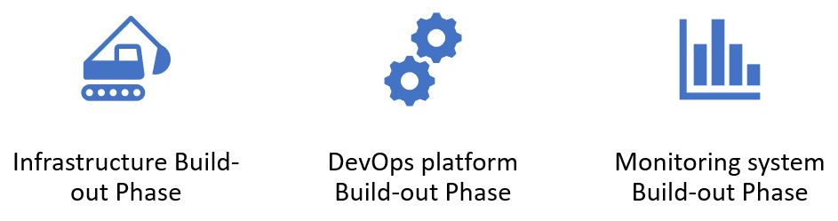

# DEVOPTYMIZE 

By simplifying the challenging tasks of building and managing cloud environments, DevOptymize assists Cloud and DevOps engineers for the same. Its a framework as well as a accelerator that offer increased cost control, security, and stability. 

Essentially, DevOptymize is like other tools but "amplified". It comprises a set of practices and tools that accelerate the adoption and implementation of DevOps practices on the Cloud for organizations.

Devoptymize is intended to ease or help in the bootstraping of a new project during the onboarding stage.

## How do we make it happen?

We do follow a three-step approach to bootstrap your journey on AWS

1. Infrastructure Build-out Phase

Utilize our pre-built AWS terraform/CloudFormation blueprint templates to swiftly establish or build infrastructure on AWS. Within minutes, we create secure cloud environments using infrastructure-as-code that is generated dynamically from templates and pre-built reference AWS blueprints.

With our "Reference Blueprints" you can establish a robust foundation for your AWS Cloud Architecture, which includes a Multi-Account AWS Architecture that provides secure operation for all your services. Account boundaries segment applications, ensuring a secure design that meets HIPAA/PCI/SOC compliance requirements. Additionally, our framework-based infrastructure scales effortlessly, reducing technical debt while catering to future business demands.

2. DevOps platform Build-out Phase

Next Phase would be to create a DevSecOps platform that is adaptable and scalable, supporting your SDLC's CI/CD process. Initially, we focus on the essential DevOps components and incrementally expand.

Platform with which we can fully automate  Zero Downtime deployments to enable teams to rapidly deploy software without human intervention. If something goes awry, easy rollbacks allow for a return to a prior version. Our accelerator framework system is entirely built using open-source software, all of which is freely accessible. You will have full control over it and the ability to determine its operation.

3. Monitoring system Build-out Phase

Next phase would be to integrate observability systems to ensure effective monitoring of the platform. Our framework offers enhanced observability and can leverage reusable code which empowers the applications to define the metrics, alerts, and escalations they require. With our framework, you will have access to visually appealing dashboards and expertly crafted Grafana dashboards. We will be able to take action on relevant alerts and receive notifications via Slack

Read more about the DevOptymize building blocks [here](./Documentation/building_blocks.md)

## DevOptymize Components

The whole of the framework is composed of three parts

1. Master Repository
2. Jenkins automation Engine
3. Child Repository
  
    - **The Master Repository** is the main repository that contains the source code of the project which is basically our IaC code templates from which the Jenkins automation engine would create customised IaC for with the desired tool (Terraform or Cloudformation)

    - **Jenkins automation Engine** - We have primarily come up with a simple automation engine by using Jenkins as UI tool to receive the inputs from the engineers who would be using the framework. backend of the engine is our custom created scripts and pipeline which is the core of our framework

    - **Child Repository** is a repository that is created by our Jenkins automation engine by collating our templates in the Master Repository and values given as inputs by engineers to the Jenkins. Basicaly it means that the templates in the Master Repository will be modified by our Jenkins automation, based on the user inputs and kept in a separate repo which should be IaC repo our our new project going forward.

## How to start with DevOptimize?

### Step 1

We need to generate several new repositories based on the following descriptions. These repositories can be created using various Git providers such as AWS CodeCommit, Bitbucket Cloud, Bitbucket Server, GitHub, GitLab, and others

Create new repos with the below names based on the IaC Tools selected 

   1. DevOptymize_CloudFormation
   2. DevOptymize_Terraform
   
Fork  the below repos 

   1. [DevOptymize_Jenkins_Pipelines](https://github.com/devoptymize/devoptymize-jenkins-pipelines)
   2. [DevOptymize_Jenkins_Shared_Libraries](https://github.com/devoptymize/devoptymize-jenkins-shared-libraries)

### Step 2

1. The users/enginners to update the new git urls that was created in step 1 in the shared libraries (follow [link](./Documentation/update_shared_libs.md) for more details).
2. Run the shell script to create jenkins server on EC2 (follow [link](./Documentation/Install_&_configure_jenkins_using_script.md) for more details).
3. Configure the git user credentials to the jenkins under the name devoptymize. < WIP >
4. Create clientspecific jenkins user and creating roles and assigning it to the user < WIP >
   
### Step 3

1. Create seed job and run the same to create the devoptymize view and the two multibranch pipelines (Config and Resource)
2. Run the create client specific iam user job.

### Step 4

1. Run the Create credential jobs under the config Multibranch pipeline
2. If the client needs to create infra using tf they need to run the s3 bucket and dyamo db creation pipeline.

## INITIAL PIPELINES TO RUN ON JENKINS 

### SEED JOB

The  Seed job creates a view that will be client specific. A multi-branch pipeline of the  respective repository which includes loading the pipelines ,creating AWS credentials in Jenkins credential manage, and creating the S3 & DynamoDB to store the Terraform state files and manage the Terraform lock respectively. 

To configure seed job , [click here](./Documentation/seedjob_reamdme.md) 

### CREATE PROJECT SPECIFIC IAM USER

This pipeline will create project-specific IAM user creds in Jenkins credentials .
To configure pipeline [click here](./Documentation/create_client_specific_iam_user_reame.md)

### MULTIBRANCH PIPELINES UNDER PROJECT VIEW 

The [multi-branch pipeline](./Documentation/multibranch_pipeline_udner_clientview_readme.md)  of the client_jenkins repository. This includes loading and trigegering the resource pipeline . 

### CREATE AWS_SECRET PIPELINE 

The pipeline is to create the AWS credetnials in jenkins credentials manager for the project which will be AWS account specific.
To configure pipeline, [click here](./Documentation/create_aws_secret_pipeline_readme.md)

### CREATE S3_DYNAMODB PIPELINE
The pipeline is to create an S3 bucket storing terraform statefile and DynamoDB for maintaining the lock for the project .
To configure pipeline , [click here](./Documentation/create_s3dynamoDB_pipeline_readme.md)

     
     
